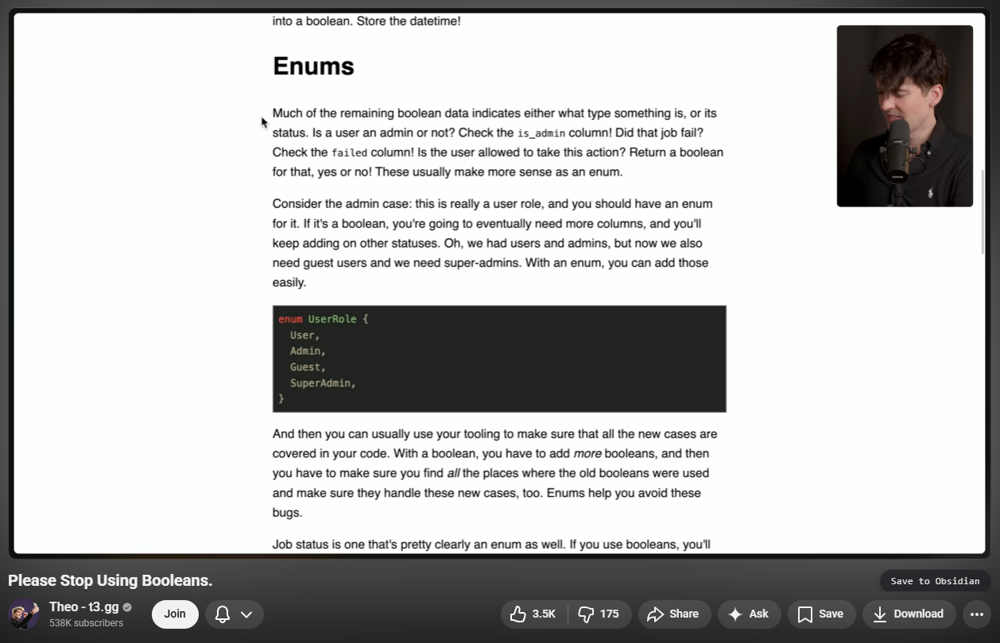
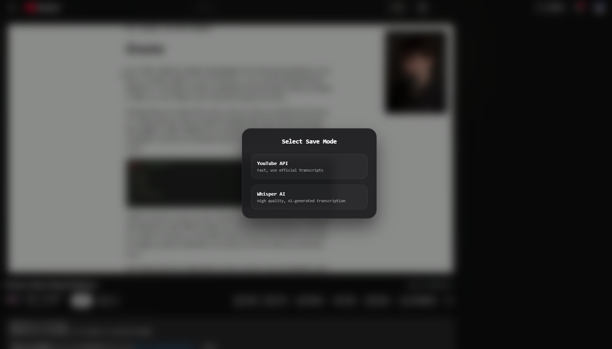
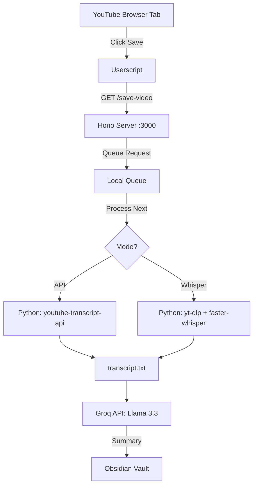

# save-yt-vid

This is a bit of a userscript with a tiny backend that I built for myself in order for me to be able to save YouTube video summaries to my Obsidian with the click of a button.

## The Problem

For saving the summary of every interesting YouTube video I come across into my Second Brain in Obsidian, it's a huge pain to manually fetch the transcript every single time, feed it into ChatGPT, and then copy-paste the resulting summary back into my Obsidian. There's too much friction here, which discourages me from saving all the valuable insights provided, into my Second Brain.

So I wrote a userscript, with a tiny backend, in order to help me automate this process.

## How It Works

To put it simply, the userscript merely adds a button and an overlay to YouTube from which I can trigger the entire process, which is done by sending a request to a port running on my own machine, where a tiny backend powered by Hono is running.




Upon receiving this request, which includes two query params, one for the video's URL itself, and the second for the mode of fetching the transcription (API or OpenAI's Whisper), the backend then queues the request into a local `queue.json` file. This is important because it ensures that even if I go on a clicking spree, the requests are processed sequentially and my machine doesn't blow up trying to run multiple Whisper instances at once.

The backend then processes this queue one by one and executes the respective python script for fetching the transcription. After this, the transcription is sent to Groq via its API, which then fetches the summary based on the transcription.

This whole setup is a bit of a hybrid system. I'm using local AI (Whisper) for the heavy lifting of transcription whenever the API isn't enough, and then using a cloud API (Groq) for the actual summarization because it's insanely fast. Finally, instead of messing around with any Obsidian plugins or APIs, the backend just writes the final markdown file directly into my Obsidian vault's local folder. It's simple, local-first, and just works.

### System Architecture



#### On the modes of fetching the transcription

The modes for fetching the transcription are:

1.  **YouTube Transcript API**: Uses the `youtube-transcript-api` python package. This is fast and efficient but only works if the video has available transcripts.
2.  **OpenAI's Whisper**: Uses the `faster-whisper` python package. This involves first downloading the audio of the YouTube video using the `yt-dlp` python package, and then running it locally, on-device, through faster-whisper in order to obtain the transcription. This is slower but highly accurate and works on any video.

## How to set it up on your own

### 1. Prerequisites

- **Bun**: For running the TS backend and managing the monorepo.
- **Python 3.10+**: For the transcription logic.
- **Groq API Key**: Get one for free at [console.groq.com](https://console.groq.com/).
- **Userscript Manager**: Violentmonkey (recommended) or Tampermonkey.

### 2. Backend Setup

1.  **Clone the repo** and navigate to the server package:
    ```bash
    cd packages/server
    ```
2.  **Install dependencies**:
    ```bash
    bun install
    ```
3.  **Setup Python environment**:
    ```bash
    python -m venv .venv
    source .venv/bin/activate  # On Windows: .venv\Scripts\activate
    pip install youtube-transcript-api yt-dlp faster-whisper torch
    ```
4.  **Configure Environment**:
    Create a `.env` file in `packages/server/`:
    ```env
    GROQ_API_KEY=your_key_here
    ```
5.  **Set your Obsidian Path**:
    Update the `writeFileSync` path in `packages/server/src/index.ts` to point to your Obsidian vault's "Inbox" or "Uncategorized" folder.

### 3. Userscript Setup

1.  **Install from root**:
    ```bash
    bun run userscript:build
    ```
2.  **Add to Browser**:
    - Open the generated file: `packages/userscript/dist/@save-yt-vid/userscript.user.js` in your browser.
    - Your userscript manager will prompt you to install it.

### 4. Usage

1.  **Start the server**:
    ```bash
    bun dev
    ```
2.  **Open YouTube**: Go to any video.
3.  **Click "Save to Obsidian"**: Choose your mode in the modal, and wait for the summary to appear in your vault!

---

_Built with Bun, Hono, Groq, and Whisper AI._
